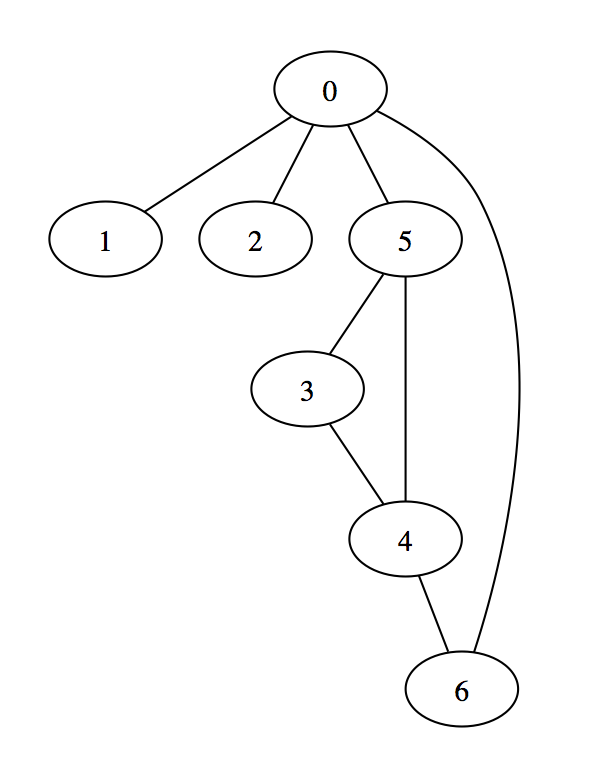

# graffy

Simple graph representation and manipulation in Clojure.

## Usage



```clojure
(def g (-> {}
           (add-edge 0 1)
		   (add-edge 0 2)
		   (add-edge 0 5)
		   (add-edge 0 6)
		   (add-edge 3 4)
		   (add-edge 4 6)
		   (add-edge 5 3)
		   (add-edge 5 4)))

(dft g 0) ;=> [0 1 2 5 3 4 6]
(bft g 0) ;=> [0 1 2 5 6 3 4]
(dft g 5) ;=> [5 0 1 2 6 4 3]
(bft g 5) ;=> [5 0 3 4 1 2 6]
```

## License

Copyright © 2013 David Rupp

Distributed under the Eclipse Public License, the same as Clojure.
